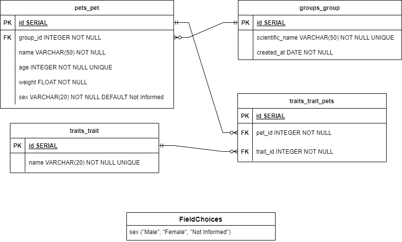
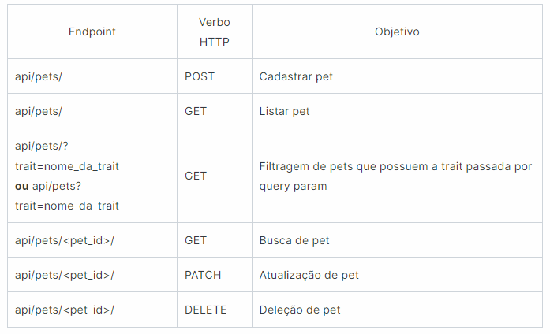

# Pet Care

API desenvolvida para controle e organização dos animais de um petshop

 

## **Tabelas do banco de dados**  

 

  

  
  
## **Rotas**  

 

  

 

### Tecnologias utilizadas:

- Python;
- Django;
- Django rest framework;
- DjangoORM;
- pytest;
- sqlite3;
- Datetime;